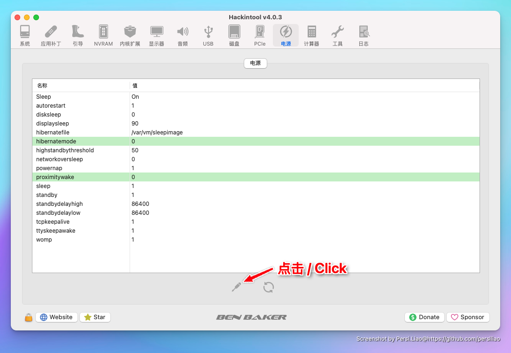
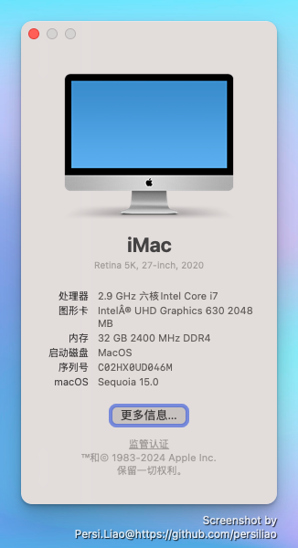
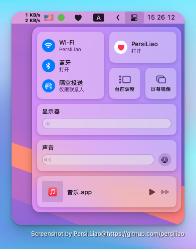
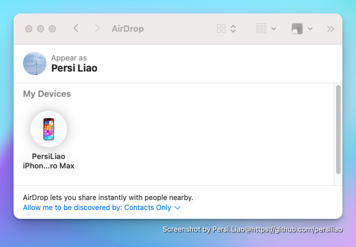
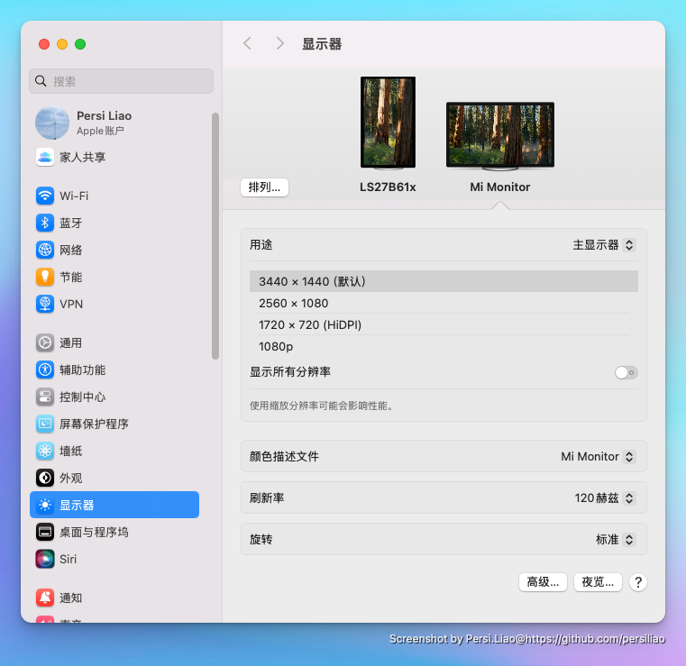

# Hackintosh-Deskmini310-EFI

> ASRock Deskmini 310 macOS 15 Sequoia OpenCore EFI

#### 硬件配置 / Hardware configuration

* 主板 / Motherboard: ASRock 310
* CPU: i7-9700
* 内存条 / RAM:  金士顿(Kingston) 16G DDR4 2400MHZ x 2
* 硬盘 / Hard Drive: WD 1T M.2 NVMe SSD
* Wireless Card / 无线网卡: Broadcom BCM94360CS2  转接卡

#### 功能 / Functions

* 睡眠 & 唤醒 / Sleep & Wake: <strong style="color:green">OK</strong>
* 无线网卡 / WIFI : <strong style="color:green">OK</strong>
* 有线网卡  / Wired Internet:  <strong style="color:green">OK</strong>
* 蓝牙 / Bluetooth:  <strong style="color:green">OK</strong>
* Handoff / 接力:  <strong style="color:green">OK</strong>
* 声卡 / Audio:  <strong style="color:green">OK</strong>
* CPU 变频 / CPU Frequency:  <strong style="color:green">OK</strong>
* DP & HDMI 4K / DP & HDMI 多屏输出显示4K:  <strong style="color:green">OK</strong>

#### BIOS设置 / BIOS Settings

* CPU Configuration -> **CPU C states Support** : <strong style="color:green">Enabled</strong>
* CPU Configuration -> **CPU C states Support** -> **CFG Lock** : <strong style="color:red">Disabled</strong>
* Chipset Configuration -> **Vt-d**: <strong style="color:red">Disabled</strong>
* Chipset Configuration -> **Onboard HD Audio**: <strong style="color:green">Enabled</strong>
* USB Configuration -> **XHCI Hand-off**: <strong style="color:green">Enabled</strong>
* Super IO Configuration -> **Serial Port**: * Chipset Configuration -> **Vt-d**: <strong style="color:red">Disabled</strong>
* Security -> **Secure Boot**: <strong style="color:red">Disabled</strong>
* Boot -> **Compatibility Support Module(CSM)**: <strong style="color:red">Disabled</strong>

#### 关于休眠

* 睡眠修复Shell方式,终端下执行
```shell
sudo pmset standby 0
sudo pmset autopoweroff 0
sudo pmset hibernatemode 0
sudo pmset proximitywake 0
```

* 使用Hackintool电源修复


#### 其它注意事项 / Other

* OpenCore 升级到<strong style="color:red">1.0.0</strong>版本及以上
* BIOS版本<strong style="color:red">4.0</strong>及以上
* 默认开启了Console输出日志，方便排错，在正常安装没问题之后，请自行删除boot-args中含FE41995C9F82参数中<strong>-v</strong>值
    > NVRAM -> Add -> *FE41995C9F82* boot-args
* 请务必修改<strong style="color:red">三码</strong>
* EFI并非通用，如果遇到问题请自行查阅相关资料或者提ISSUE

#### 截图 / Screenshots




